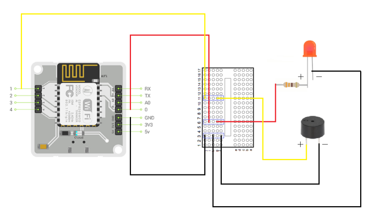

# boltiot-netwizard

**Description** : Bolt IoT and ML Training Project

**Hardware Requirement** : Wireless Network Adapter (optional), Bolt IoT Device, Buzzer, LED, 330 Ohm Resistor, Connecting Wires

**Requisite** : Make sure you have Python3 installed in your System 

**How to Run (Linux)** :

1. Use the Wireless Network Adapter to connect to your WiFi (optional)

2. Setup the Bolt IoT Device circuit connection as shown below

3. Install requirements.txt to install necessary packages [**$ python3 -m pip install -r requirements.txt**] 

4. Edit conf.py and add your own credentials [**$ nano conf.py**]

5. Run wifiscout.py to monitor connected devices in your WiFi Network and send Telegram alerts [**$ sudo python3 wifiscout.py**]

6. The no. of times LED is going to flash will indicate no. of devices connected in your Wifi Network

7. Run pingmaster.py to detect Internet Ping anomalies by Z-Score analysis and send Telegram alerts [**$ sudo python3 pingmaster.py**]

8. When the buzzer will turn on, it will indicate an Internet Ping anomaly has been detected

9. Run netwizard.py to do BOTH simultaneuosly [**$ sudo python3 netwizard.py**]
 
**Circuit Connection** :

 
